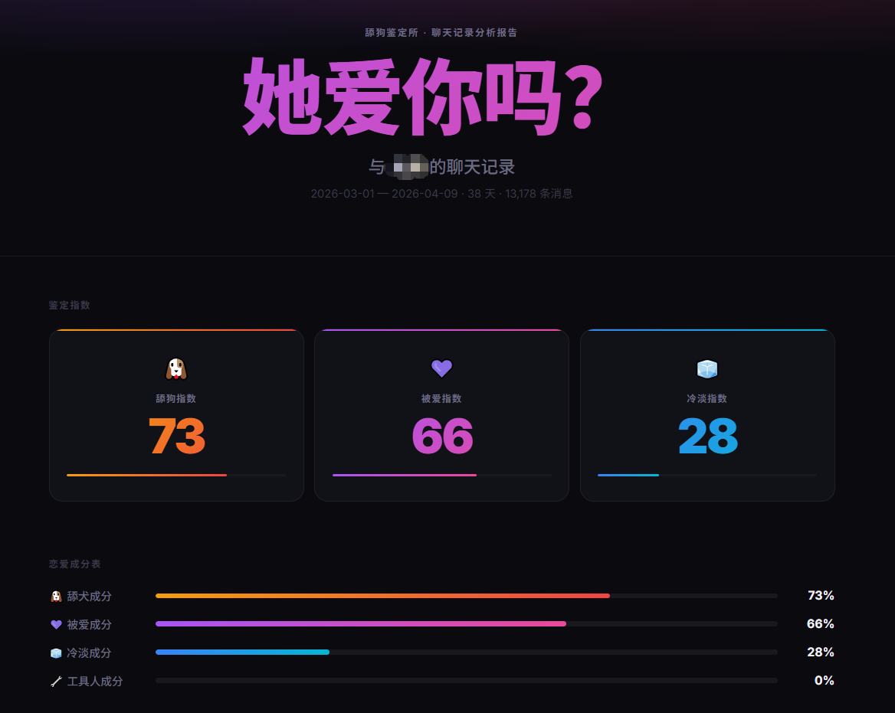
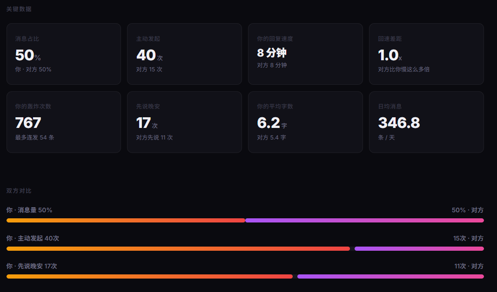
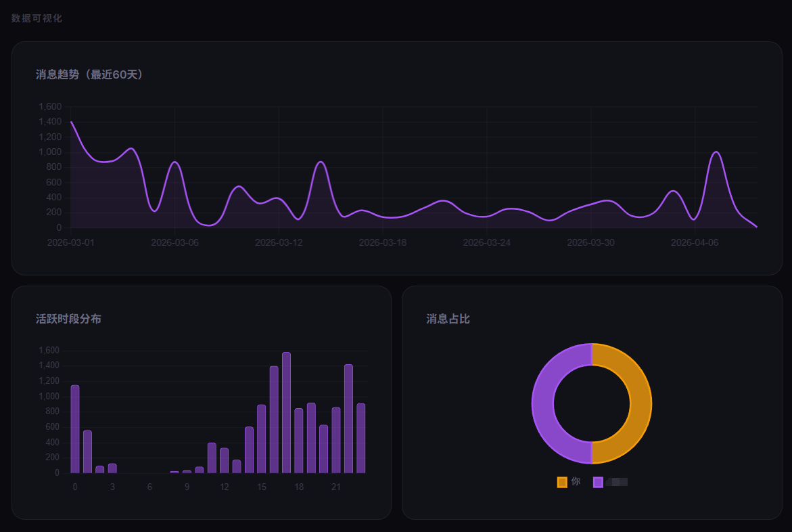

<div align="center">


<br/>

[](LICENSE)
[]()
[]()
[](https://github.com/shuakami/qq-chat-exporter)
[](https://github.com/863401402/she-love-me)
[](https://claude.ai/code)
[](https://developers.openai.com/codex/overview)
[](https://cursor.sh)
[](https://github.com/863401402/she-love-me/pulls)

[快速开始](#快速开始) · [Agent 使用示例](#agent-使用示例) · [当前能力](#当前能力) · [功能特性](#功能特性) · [更新与版本](#更新与版本)

</div>

---

## 简介

**她不一样** 是一个**通用 Agent Skill**，支持 Claude Code、Codex、Cursor、GitHub Copilot、Gemini CLI 等主流 AI 编程工具。

在仓库根目录启动 Agent，用一句指令（例如 Claude 里输入 `/she-love-me`，Codex 里输入 `$she-love-me`），它会引导你导出或导入微信、QQ 聊天记录，完成全量统计、用户选定范围的采样分析和报告生成，帮你看清：**她是不是真的不一样——这段感情里，你们到底是什么关系？**

项目以 **Agent 驱动的分析工作流**为主：Python 脚本负责导入、统计、评分和证据校验，Agent 负责解释对话语境、按需补取上下文并生成分析。报告是分析结果的展示文件。

融入专业心理学框架（依恋类型 · Gottman · Sternberg 三角），支持**危险信号预警**、**军师建议**、**👴 祖师爷寄语**。导出、统计和文件保存本地执行；AI 分析的数据流取决于所选模型，使用云端模型或上传文件时，相关数据会发送给模型服务。

> 已有聊天导出文件也能开始，无需重新提取微信数据库。语音仅在已有转写文本时参与分析；图片与表情目前以消息记录、资源整理为主。

---

## 当前能力

| 升级 | 你会得到什么 |
| --- | --- |
| **评分校准** | 聊天行为是否均衡与投入方向分开呈现；显示评分依据、有效权重覆盖和缺失样本 |
| **按需补采样** | Agent 遇到语境不明或证据冲突时，按消息 ID 或关键词取前后文，遵守选定日期和输出预算 |
| **增量导入** | 支持的转换器合并新记录，重复导入同一批次不增加消息；保留导入数量和批次记录 |
| **证据回查** | 报告中的结构化引用可跳转到原始消息；引用原文、消息 ID、统计字段及数据摘要会被校验 |
| **历史留档** | 新报告独立保存，并附统计、分析和版本快照；旧版联系人数据首次更新前留档 |

证据不足时保留 `null` 或“数据不足”。评分是聊天行为的启发式指标，不能作为爱情概率；原文引用可回查也不等于情感推断已被证明。

这些能力已实现于当前代码。统计/评分版本为 `2.2`，新分析的证据协议为 `2.1`；它们是数据协议版本，与下方项目历史版本编号分开。

---

## 交流群

<div align="center">


*扫码加入恋爱分析交流群，遇到问题、分享分析结果、更新优化方向都可以聊*

</div>

---

## 输出效果

> 首次运行后，打开 Agent 返回的 HTML 路径；联系人报告通常位于 `data/contacts/<联系人目录>/reports/`。每份报告旁边有对应的 `.manifest.json` 快照。

### 分析指数

以下为展示示例，实际结果以当前记录、样本质量及报告中的依据为准：

```
🔥 主动指数   73 ████████░░  发起占比与消息量等行为指标
💜 被爱指数   66 ███████░░░  对方参与行为的启发式指标
🧊 冷淡指数   28 ███░░░░░░░  词表候选仍需结合对话语境

聊天行为对称性  7.4 / 10 · 有效权重覆盖 70%
缺失维度        沉默后恢复：有效样本不足
证据回查        点击“原始消息”查看引用依据
```

### 报告截图

以下为既有报告样式截图；新版报告另外展示评分依据和证据回查内容。

| 成分表 | 数据面板 | 趋势图表 |
|:---:|:---:|:---:|
|  |  |  |

| 最终鉴定结果 |
|:---:|
|  |

---

## 功能特性

| 功能 | 说明 |
|------|------|
| 📥 **多来源导入** | 支持 weflow-cli、CipherTalk、QQ Chat Exporter、旧 WeFlow JSON 和带时间戳 Markdown |
| 👥 **联系人选择** | 按消息数量排列，选你想分析的那个人 |
| ⚖️ **行为评分校准** | 对称性分数交换双方后不变；投入方向独立展示，缺少维度不视为均衡 |
| 🔎 **Agent 补采样** | 消息 ID / 关键词检索前后文，日期范围、消息预算、字符预算与数据摘要校验 |
| 🔄 **增量导入** | weflow-cli / CipherTalk / Markdown 转换器自动合并，记录新增、重复、转写补充和丢弃数量 |
| 🔗 **原文证据回查** | 结构化结论关联原始消息，校验引用及数据版本，点击跳转查看 |
| 🗃️ **历史报告快照** | 独立报告文件与统计/分析快照，保留评分版本及已提供的模型/提示词标识 |
| 📊 **主动指数** | 主动发起占比 · 连续轰炸次数 · 回复速度差 · 消息长度比 |
| 💜 **被爱指数** | 对方主动次数 · 晚安/早安分析 · 关心频率 |
| 🧊 **冷淡检测** | 短回复与词表候选分开统计，结合语境判断 · 长时间未回复统计（无法证明已读） |
| 📊 **话语权分析** | 谁在主导对话，谁在迎合；权力动态量化 |
| 📈 **趋势图表** | 每日消息量 · 活跃时段 · 双方占比（Chart.js） |
| 🧠 **依恋模式分析** | 结合对话证据讨论安全型 / 焦虑型 / 回避型 / 恐惧型倾向，证据不足时留白 |
| 🔄 **追逃循环复盘** | 还原完整"案发现场"：触发→撤退→升级→恶化 |
| 💘 **Sternberg 三角** | 激情 · 亲密 · 承诺三维评分，判断爱情类型 |
| 🩹 **修复尝试分析** | 冷战后谁低头？对方接受还是继续惩罚？ |
| 💡 **情感可得性评估** | 对方此刻是否真的有能力投入这段关系 |
| ⚠️ **危险预警** | 7 类信号（煤气灯 · 爱情轰炸 · 间歇性强化 · 单相思痴迷等）· **双阈值触发**（量化+文本同时满足才高亮，否则降级为观察提示） |
| 🎯 **军师模式** | 核心诊断 + 停止/开始建议（含时机）+ 路线图 + **止损红线** |
| 👴 **祖师爷寄语** | 童锦程视角 · 读局 + 推进关系三条实招 + 关系地位指南 + 金句收尾 |
| 🔍 **AI 深度鉴定** | 全量统计层（stats.json）+ 用户选定范围分层采样，三层架构避免"全量幻觉"，评分有推导来源不靠模型主观拍板 |
| 🎯 **动态采样选择** | 自动推荐分析时间范围（1个月/3个月/半年/全量），展示每个选项的消息条数，由用户决定分析窗口 |
| 😄 **聊天 / 表情分离存储** | `messages.json` 只保留 `emoji_ref`，详细元信息放入独立的 `emojis.json`，结构更简洁 |
| 🗂️ **按联系人独立目录导出** | 每个联系人自动导出到 `data/contacts/<联系人>__<hash>/`，避免不同对象的数据相互覆盖 |
| 🖼️ **表情本地下载与预览** | `export_emojis.py` 可批量下载微信表情到联系人目录下的 `emojis_assets/`，并生成 `emojis_preview.html` |
| 🎙️ **语音转写兼容** | 数据源包含 `transcript` 时自动纳入文字统计与关系分析；暂不直接执行音频转写 |
| 🕒 **时间戳自动修复** | 自动识别秒、毫秒、微秒、纳秒和常见日期字符串，兼容不同导出工具 |
| 📄 **双格式输出** | 终端 Markdown 摘要 + 可分享的 HTML 报告 |

---

## 快速开始

### 让 Agent 完成初始化

在已经打开的项目中，把这句话发给 Agent：

```text
读取当前仓库的 AGENTS.md 和 .agents/skills/she-love-me/SKILL.md，
检查环境，并按 Skill 引导我导入微信或 QQ 聊天记录。
```

尚未下载仓库时，先按下方“安装与运行”完成下载。快速引导见 [GUIDE.md](GUIDE.md)，实际流程以当前检出的 Skill 和代码为准。

> 如果你是在会话启动后才 `clone` 仓库或切换到新分支，部分 Agent 需要在仓库根目录重开一次会话，才能重新加载仓库级 Skill（例如 Codex 中重新进入仓库根目录后再启动并触发 `$she-love-me`）。

---


### 前置条件

- Python 3.9+；从项目根目录运行，依赖见 `requirements.txt`
- 已有 JSON/Markdown 文件时可直接导入；第三方提取工具仅在需要从客户端导出时使用

**微信分析**：
- 默认路径为 Windows + WeChat 4.x，并使用管理员终端
- Node.js 18+；安装器会优先尝试 `weflow-cli`，当前环境不兼容时自动改用 CipherTalk
- Agent 会代用户检查、下载安装并运行第三方导出工具；用户只需处理登录、权限批准和联系人选择

> **已记录的微信兼容性问题**：用户在 [Issue #31](https://github.com/863401402/she-love-me/issues/31) 报告微信 4.1.13.65 下两条密钥提取路径失败，本项目尚未完成该版本的修复验证。扫描返回空账号不等于数据目录不匹配；两条路径均失败时保留脱敏诊断，使用已有 JSON/Markdown 导入。

**QQ 分析**：
- 安装并启动 [QQ Chat Exporter (QCE)](https://github.com/shuakami/qq-chat-exporter)（NapCat + QCE 插件）
- 用手机 QQ 扫码登录，获取控制台显示的 Access Token

### 安装与运行

```bash
git clone https://github.com/863401402/she-love-me
cd she-love-me
```

| 工具 | 调用方式 |
|------|----------|
| [Claude Code](https://claude.ai/code) / [OpenClaw](https://openclaw.ai) / [Cursor](https://cursor.sh) / [Copilot](https://github.com/features/copilot) / [Gemini CLI](https://github.com/google-gemini/gemini-cli) | `/she-love-me` |
| [Codex](https://developers.openai.com/codex/overview) | `$she-love-me` 或直接说"使用 she-love-me 分析聊天记录" |

Skill 会先询问数据来源，再引导导出或导入、统计分析并生成报告。

### Agent 使用示例

首次分析：

```text
使用 she-love-me 分析我和某个联系人的聊天记录。
先检查数据来源和环境，给我分析时间范围选项，再生成有依据的报告。
```

已有文件：

```text
使用 she-love-me 导入这个聊天导出文件，分析最近三个月。
如果关键句缺少语境，在我选定的范围内补取前后文。
```

更新已有联系人：

```text
把这份新导出记录合并到原来的联系人目录，告诉我新增和重复了多少条。
重新统计、采样和分析，生成一份新报告，保留旧报告。
```

Agent 将按数据来源选择导入工具；选择同一联系人目录时会核对来源与账号。旧版 QQ / WeFlow 转换结果可经 `update_chat_bundle.py` 合并到独立存档目录，详见下方“增量导入与证据回查更新”。

### 其他使用方式

仓库仍保留[传统脚本方案](traditional-deployment/README.md)：导出 `messages.json`，生成 `analysis_prompt.txt` 后交给聊天模型。完整的按需补采样和新版证据报告流程以 Agent Skill 为准。

各 Agent 都路由到同一份 `.agents/skills/she-love-me/SKILL.md`：Codex/Cursor 读取 `AGENTS.md`，Claude Code 由 `.claude/settings.json` 注册，Copilot 使用 `.github/copilot-instructions.md`，Gemini CLI 使用 `GEMINI.md`，OpenAI/Codex 的技能元数据位于 `agents/openai.yaml`。

### Windows 微信：首选 weflow-cli

从 GitHub 新 clone 时，不再尝试下载已被屏蔽的 `wechat-decrypt`。Skill 会自动执行 [weflow-cli](https://github.com/zhuobichen/weflow-cli) / CipherTalk 的检查、安装与初始化流程（Agent 平台要求时会请求联网/安装授权）：

```powershell
py scripts/setup_chat_exporter.py --provider auto --install
weflow-cli init
weflow-cli sessions
weflow-cli export "<联系人或 wxid>" json --output ".\data\raw"
```

把实际生成的 `<wxid>_messages.json` 转成项目统一格式：

```powershell
py scripts/convert_weflow_cli.py `
  --input ".\data\raw\<wxid>_messages.json" `
  --contact "<联系人显示名>" `
  --contact-id "<wxid>" `
  --output-dir data/contacts
```

通常无需手工执行上面的命令；它们用于说明 Agent 实际完成的步骤。`weflow-cli` 是当前可用的第三方项目，但不属于本仓库，也未经过本仓库的独立安全审计；微信版本升级或上游状态变化可能影响可用性。

### 备选：CipherTalk CLI

```powershell
npm install -g ciphertalk-cli
py scripts/diagnose_ciphertalk.py
py scripts/diagnose_ciphertalk.py --configure
miyu --format=json --quiet key get --save
miyu --format=json --quiet --limit=30 sessions
miyu --format=json --quiet export "<会话 ID>" --output ".\data\raw\chat.json"
py scripts/convert_ciphertalk.py `
  --input ".\data\raw\chat.json" `
  --contact "<联系人显示名>" `
  --contact-id "<会话 ID>" `
  --output-dir data/contacts
```

`diagnose_ciphertalk.py` 会寻找有效账号目录并检查配置是否完整，但绝不输出数据库密钥。若 npm CLI 自动取密钥超时，不要反复重新登录：使用本项目的无界面适配器调用 CipherTalk 官方多进程扫描函数：

```powershell
py scripts/diagnose_ciphertalk.py --scan-key --download-scanner
```

该命令只从 `ILoveBingLu/CipherTalk` 固定官方 tag 下载约 468 KB 的 `wechat_key_tool.dll` 和匹配服务源码，校验固定 SHA-256 后运行；密钥直接写入本机 miyu 配置，不进入标准输出。只有返回 `database_validated=true`，或 `run_ciphertalk_cli.py --timeout 60 -- status` 返回 `connection.ok=true` 后，Agent 才继续列会话和导出。`scanAccount()` 返回的未验证候选不能当作端到端成功。

只有无界面扫描也失败时，才下载官方桌面版作为最终兼容兜底：

```powershell
py scripts/setup_ciphertalk_desktop.py --download
```

用户在桌面版完成账号配置、主界面能够查看会话后，Agent 会继续使用桌面版官方 MCP，不需要用户手工逐个导出：

```powershell
py scripts/setup_ciphertalk_mcp.py --install
py scripts/list_ciphertalk_sessions_mcp.py --limit 30
py scripts/export_ciphertalk_mcp.py `
  --session-id "<会话 ID>" `
  --contact "<联系人显示名>" `
  --output-dir data/raw/ciphertalk-official
py scripts/convert_ciphertalk.py `
  --input "<export_ciphertalk_mcp.py 返回的 output>" `
  --contact "<联系人显示名>" `
  --contact-id "<会话 ID>" `
  --output-dir data/contacts
```

`setup_ciphertalk_mcp.py` 只在 `scripts/tmp/` 安装桌面启动器遗漏的固定版本 MCP SDK，该目录不会提交。完整聊天必须通过官方 `export_chat` 导出；不要用 `get_messages` 的 offset 分页拼接全量数据，部分版本会循环返回旧页并污染统计。桌面版 detailed-json / ChatLab JSON 仍可直接交给 `convert_ciphertalk.py`。

### 其他已有导出文件

旧版 WeFlow JSON 仍可导入，但 WeFlow 官方核心源码和 Release 已移除，不再推荐新用户安装：

```bash
python scripts/convert_weflow.py --input "weflow.json" --output-dir data/contacts
```

带时间戳的 Markdown 也可以导入：

```bash
python scripts/convert_markdown.py --input "chat.md" --my-name "我" --contact "联系人" --output-dir data/contacts
```

Markdown 基础格式：`[2026-08-12 20:10] 张三: 消息内容`。转换完成后，沿用返回 JSON 中的 `messages_path` 和 `bundle_dir`。

如果你已经有可信的兼容解密器目录，旧版入口仍可使用：

```bash
python scripts/decrypt_wechat.py --decryptor-dir "<本地兼容解密器目录>"
```

### 可选：导出微信表情资源

如果你想把某个联系人的微信表情也一起整理出来：

```bash
python scripts/extract_messages.py \
  --decrypted-dir vendor/wechat-decrypt/decrypted \
  --contact "联系人名字" \
  --output-dir data/contacts

python scripts/export_emojis.py \
  --input "data/contacts/<联系人目录>/messages.json"
```

默认会在该联系人目录下生成：

- `messages.json`：聊天记录（表情消息仅保留 `emoji_ref`）
- `emojis.json` / `emojis.csv`：独立表情记录与清单
- `emojis_assets/`：去重下载后的表情资源
- `emojis_download_manifest.json`：下载结果
- `emojis_preview.html`：本地浏览器预览页

这样聊天记录和表情记录**分开但不断链**：`messages.json` 的某条表情消息通过 `emoji_ref` 关联到 `emojis.json` 中的具体表情数据。

---

## 工作原理

```
weflow-cli / CipherTalk / 旧导出文件 / NapCat + QCE（QQ）
    │
    │  微信：第三方工具导出 JSON → 本项目转换器
    │  QQ：REST API 导出聊天记录
    ▼
统一消息数据 + 稳定消息 ID + 导入批次
    │
    ├─► stats_analyzer.py → stats.json（全量统计 + 确定性行为评分）
    │
    ├─► build_chat_history.py（用户动态选择分析范围）
    │       → chat_history.txt（用户选定范围内的分层采样，附消息 ID）
    ▼
AI Agent 深度分析（统计 + 采样；按需 query_chat_context.py 补取语境）
    │  Sternberg 三角（信号计数推导）· Gottman 正负比（词典+文本校正）
    │  对称性评分（复制引擎结果）· 投入方向 · 双阈值危险预警
    │  依恋类型 · 核心恐惧 · 防御机制 · 军师建议 · 👴 祖师爷寄语
    ▼
analysis.json（结论 + 消息证据 + 数据摘要）
    │
    ▼
证据校验 → HTML 报告 + Markdown 摘要 + 历史快照
```

> 微信解密原本依赖 `ylytdeng/wechat-decrypt`，该上游仓库已于 2026-07-15 因 DMCA 被 GitHub 屏蔽；WeFlow 官方核心源码和 Release 也已移除。本项目不会推荐来源不明的镜像。Windows 微信当前首选 weflow-cli JSON，备选 CipherTalk JSON；QQ 依赖 [shuakami/qq-chat-exporter](https://github.com/shuakami/qq-chat-exporter)。

---

## 项目结构

```
she-love-me/
├── .agents/skills/she-love-me/
│   ├── SKILL.md                               # 唯一 Skill 入口（所有工具共用）
│   ├── agents/openai.yaml
│   └── references/                            # 知识库（SKILL.md 按需读取）
│       ├── analysis-framework.md              # 心理学分析框架（模块 F / A / B）
│       ├── risk-signals.md                    # 危险预警 7 类信号 + 双阈值触发规则
│       ├── strategist-guide.md                # 军师 / 童锦程寄语 / 语气风格
│       ├── report-schema.md                   # analysis.json 结构 + 评分推导规则
│       └── report-template.md                 # Step 9 Markdown 展示模板
├── .claude/settings.json                      # Claude Code Skill 路径注册
├── references/tong-jincheng/                  # 祖师爷心智模型参考材料
├── scripts/
│   ├── setup_check.py                         # 环境检查 / 依赖准备
│   ├── setup_chat_exporter.py                 # 检查/安装 weflow-cli 或 CipherTalk
│   ├── setup_ciphertalk_mcp.py                 # 准备官方桌面 MCP 运行依赖
│   ├── list_ciphertalk_sessions_mcp.py         # 安全列出桌面版会话
│   ├── export_ciphertalk_mcp.py                # 通过官方 export_chat 完整导出
│   ├── decrypt_wechat.py                      # 微信解密入口
│   ├── list_contacts.py / list_contacts_qq.py
│   ├── extract_messages.py / extract_messages_qq.py
│   ├── convert_weflow_cli.py / convert_ciphertalk.py # 当前微信 JSON 转换
│   ├── convert_weflow.py / convert_markdown.py       # 旧 WeFlow / Markdown 转换
│   ├── message_normalizer.py                         # 时间戳与消息结构归一化
│   ├── bundle_store.py / update_chat_bundle.py        # 增量合并、原子写入与导入批次留档
│   ├── contact_bundle.py                      # 统一生成联系人导出目录与各类默认路径
│   ├── export_emojis.py                       # 读取 emojis.json / 下载本地资源 / 生成预览页
│   ├── stats_analyzer.py                      # 全量统计分析引擎
│   ├── scoring_calibration.py                 # 聊天行为对称性、投入方向、缺失样本依据
│   ├── build_chat_history.py                  # 分层采样：动态范围选择 + 关键窗口提取
│   ├── query_chat_context.py                  # Agent 按消息 ID / 关键词补取有限上下文
│   ├── analysis_evidence.py                   # 消息引用、原文、统计字段与数据摘要校验
│   └── generate_html_report.py                # HTML 报告生成（微信/QQ 共用）
├── tests/                                     # 导入、统计、证据、补采样与导出适配回归测试
├── vendor/                                    # wechat-decrypt（gitignore）
├── data/
│   └── contacts/<联系人>__<hash>/             # 每个联系人的独立导出目录（gitignore）
└── reports/                                   # 其他生成的 HTML 报告（gitignore）
```

---

## 支持平台

| 平台 | 微信 | QQ | 备注 |
|------|------|-----|------|
| Windows | ✅ 支持 | ✅ 支持 | 微信首选 weflow-cli；QQ 无需管理员 |
| macOS | 📄 导入 | ✅ 支持 | 可导入已有 JSON/Markdown；不提供默认本机提取工具 |
| Linux | 🔜 规划中 | ✅ 支持 | QQ 通过 Docker NapCat 部署可用 |

---

## 更新与版本

### 获取更新

在仓库根目录让 Agent 检查当前分支、未提交改动和远端更新，再更新代码。功能是否可用以检出的代码为准；维护分支中的更新在合入主分支前，不会出现在主分支下载包中。

更新代码后，重新运行统计与分析才能使用新版评分。已有数据保留在 `data/`、导出工具及配置保留在 `vendor/` 或工具自己的本机目录；切换账号或数据来源时使用独立联系人输出目录。

### 统计可靠性更新

- 无有效回复样本时，平均间隔和倍数为 `null`，报告显示“数据不足”；新增有效样本数、中位数和 P90。
- 回复间隔只统计相邻双方消息的 10 秒至 24 小时间隔，不代表消息阅读时间。
- “爱你”“想你”等短句不再因字数被计入冷淡词表；词表命中仍需结合上下文，不直接证明冷淡。
- 连发统计在超过 3 小时的消息间隔处切断，避免跨天累计。
- 长时间未回复统计涵盖双方连续交替发言后的长间隔；仅统计已经观察到对方后续消息的事件，记录末尾的等待不推断为超时。
- 当前 `stats_version` 和 `scoring_version` 为 `2.2`；旧报告保留原结果，使用新版脚本重新统计后评分可能变化。

### Agent 评分校准与补采样

统计版本与评分版本更新为 `2.2`：新增 `balance_calibration`，按对话发起、回复间隔中位数、沉默后恢复、消息量衡量聊天行为对称性。交换双方后分数不变；投入方向独立展示。样本不足的维度列出原因，仅在有效权重覆盖至少 70% 且消息量/发起维度有效时评分。项目的权重与样本门槛是启发式规则，不代表爱情概率或统计置信度。报告展示引擎分数、有效权重覆盖和各维度依据；Agent 文本解释不能覆盖引擎分数。

Agent 在关键句语境不明或危险预警证据不足时可调用 `scripts/query_chat_context.py`，按真实消息 ID 或具体关键词补取前后文。支持用户选定日期范围、当前数据摘要校验、窗口去重及消息/字符预算，输出可复查 JSON。Skill 将每次分析限制为最多两轮补采样；不足时留白，不扩大用户选定范围。

### 增量导入与证据回查更新

`convert_weflow_cli.py`、`convert_ciphertalk.py` 和 `convert_markdown.py` 现在自动合并已有联系人记录，重复导入同一批次不增加消息，也不会覆盖旧记录。每批导入保存在联系人目录的 `imports/`，`messages.json` 内的 `import_history` 记录新增、重复、转写补充和丢弃数量。首次更新旧版数据会保存 `imports/legacy.json`。

来源、账号和联系人必须一致。切换导出工具或账号请使用独立输出目录；账号未知时无法自动识别同名联系人属于不同账号，应手动分目录。没有原始消息 ID 的 Markdown 按内容、时间和出现次数识别消息：保留完整导出中的同秒同文多条记录，重叠片段存在歧义时要求重新导入完整记录。这种来源无法证明另一次完全相同的新增事件，导入批次会标明限制。

已有统一格式 `messages.json`（包括 QQ / 旧工具导出的转换结果）可以合并到独立存档目录：

```powershell
python scripts/update_chat_bundle.py --input "<已有 messages.json>" --output-dir data/contacts-archive
```

消息带有稳定 `message_id`，采样文件同步显示 ID 和 `messages_digest`。新版分析声明 `schema_version: "2.1"`，复制该数据摘要，并给每条 `key_findings` / `danger_warnings` 填写 `evidence_message_ids`；可用 `stats_fields` 指向统计来源。结构与示例见 `.agents/skills/she-love-me/references/report-schema.md`。

```powershell
python scripts/generate_html_report.py --stats "<bundle_dir>/stats.json" --analysis "<bundle_dir>/analysis.json" --messages "<bundle_dir>/messages.json" --contact "联系人" --output "<bundle_dir>/reports"
```

报告会校验引用 ID、所提供引用原文、统计字段以及数据摘要；点击“原始消息”可回查消息。记录更新后必须重新统计和分析。旧版无结构化引用的分析仍可展示，并标注引用尚未校验。每份 HTML 都有独立 `.manifest.json`，保存统计/分析快照与版本信息；文件名精确到微秒，保留历次报告。快照包含分析原文，请按聊天数据管理。

### 项目历史与后续计划

- **v1.0**：文字消息分析 · HTML 报告 · 主动/被爱/冷淡指数
- **v2.0**：依恋类型诊断 · Sternberg 三角 · Gottman 四骑士 · 危险预警 · 军师模式
- **v2.1**：核心恐惧分析 · 情感可得性评估 · 权力动态量化 · 修复尝试分析 · 追逃循环复盘 · 止损红线
- **v2.2**：**QQ 聊天记录支持**（通过 QQ Chat Exporter API）· 微信/QQ 统一分析管线
- **v2.3**：👴 **祖师爷寄语**（童锦程视角）· 推进关系三条实招 · 关系地位指南
- **v3.0**：🔄 **品牌重构**「她不一样」· 叙事框架升级 · 分析模块微调 · HTML 报告开源地址
- **v3.1 架构基础**：统一 Skill 入口、参考知识拆分、分层采样引擎、动态范围选择、评分来源与可空字段设计
- **当前代码增量**：统计可靠性修复、评分校准、Agent 补采样、增量导入、证据回查和历史快照；没有为本次更新新建发行版本或 tag
- **已有多媒体能力**：语音转写文本导入；兼容数据来源下的表情元信息整理、本地下载与预览
- **后续方向**：历史趋势比较、分析范围与证据覆盖改进、导出器兼容性验证；直接音频转写及 Linux 微信本机提取尚未实现

---

## 社区支持

<div align="center">

**学 AI，上 L 站**

[](https://linux.do)

本项目在 [LINUX DO](https://linux.do) 社区发布与交流，感谢佬友们的支持与反馈。

</div>

---

## 致谢

> **ylytdeng/wechat-decrypt** — 原 WeChat 4.0 数据库解密器，本项目早期微信能力的基础；其 GitHub 仓库现因 DMCA 屏蔽，链接不再可用。

> **[zhuobichen/weflow-cli](https://github.com/zhuobichen/weflow-cli)** / **[ILoveBingLu/CipherTalk](https://github.com/ILoveBingLu/CipherTalk)** — 当前 Windows 微信第三方导出入口；Agent 会代用户安装、运行并转换导出结果。

> **[shuakami/qq-chat-exporter](https://github.com/shuakami/qq-chat-exporter)** — NapCat + QCE 插件，QQ 聊天记录导出方案 🙏

> **[hotcoffeeshake/tong-jincheng-skill](https://github.com/hotcoffeeshake/tong-jincheng-skill)** — 祖师爷童锦程心智模型与语录整理 🙏

---

## 免责声明

本工具仅供娱乐，不构成情感建议。仅用于分析你自己的数据，请勿侵犯他人隐私。导出与统计在本地执行；云端 AI 分析或手动上传文件会将相关数据发送给模型服务。当前 HTML 报告通过 Google Fonts 和 jsDelivr 加载字体与图表库，打开时会请求这些外部服务。

---

<div align="center">

**MIT License © 2026 她不一样**

*如果这个项目帮你想通了什么，记得给个 ⭐*

</div>

> 曾用名：「她爱我吗？恋情分析室」· 前身：舔狗鉴定所
